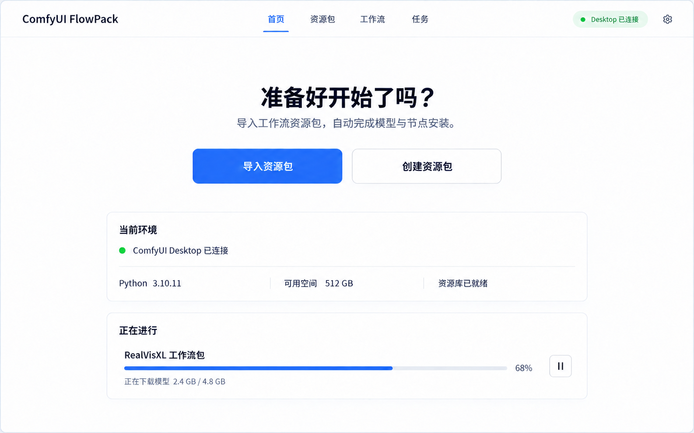
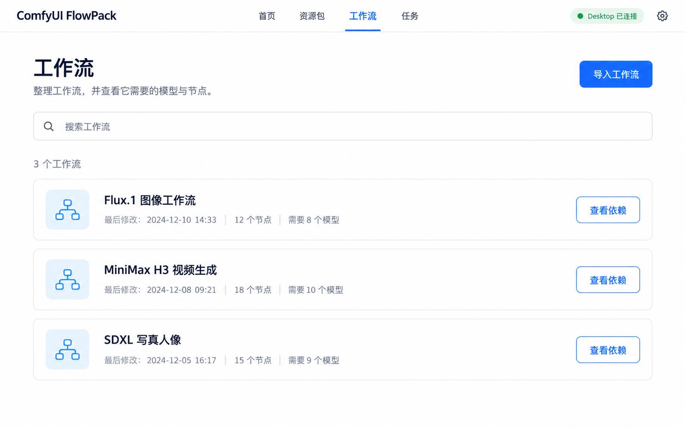
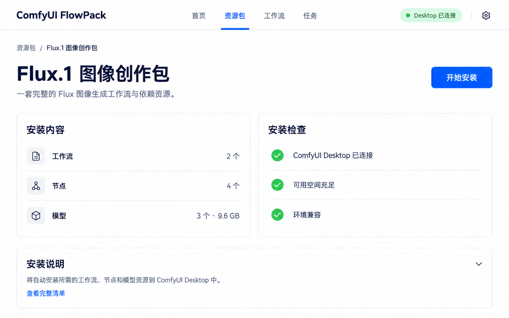
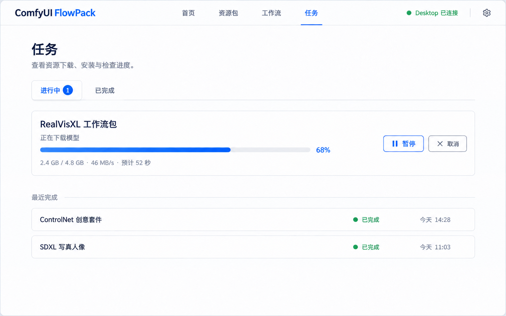
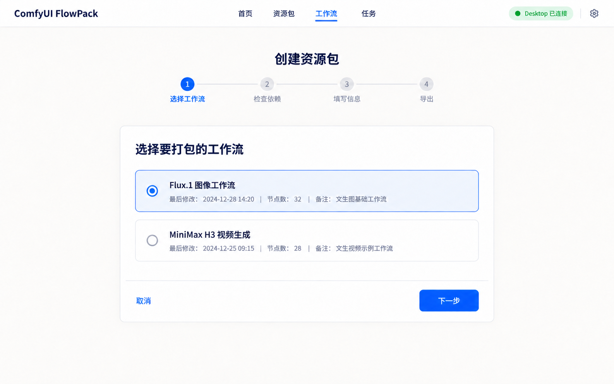
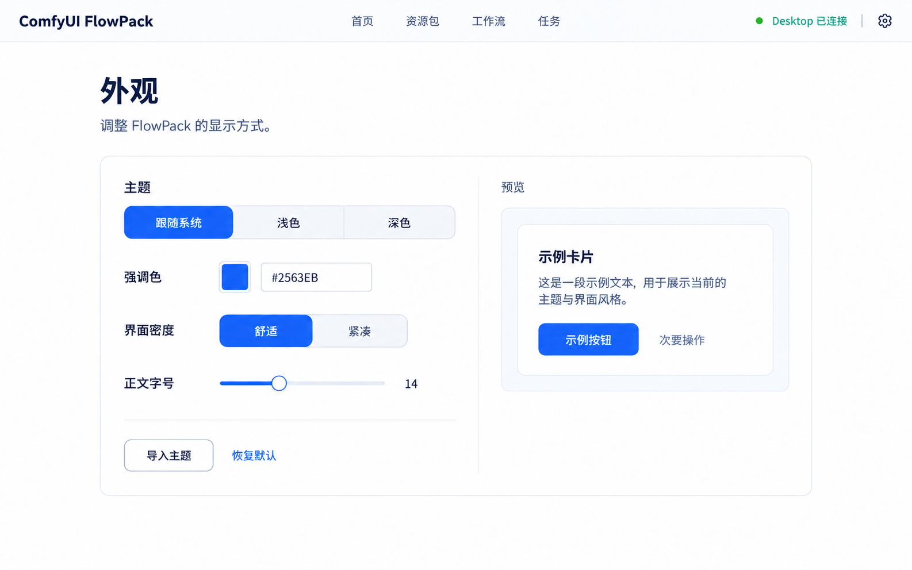

# ComfyUI FlowPack 前端视觉参考

本文件和 `frontend-references/` 中的 9 张 PNG 是 ComfyUI FlowPack 的视觉基准。`v0.1.0` 将旧视图收敛到六个顶层区域；参考图继续用于其中嵌入视图的层级、间距、色彩和交互状态。

## 全局框架

- 参考画布为 1600×1000；桌面窗口默认 1280×800 DIP，最小 960×640 DIP。
- 画面采用暖白背景、深海军蓝正文、钴蓝主操作、浅灰蓝边框、绿色成功状态。卡片圆角为 12 DIP，页面水平边距为 52 DIP。
- 顶部应用栏是所有主页面共用组件，高度固定为 80 DIP，底部使用一条极浅分割线。参考图中不显示系统标题栏和窗口控制按钮。
- 实际 WPF 实现使用一个根 `Grid`：品牌区左对齐、导航组使用 `HorizontalAlignment="Center"` 独立叠放、状态与设置区右对齐。导航不得参与左右区域的宽度分配，导航组的几何中心必须始终等于窗口中心。
- 导航固定为“首页、资源库、打包、安装、任务”，设置由右上角进入。当前项使用蓝色文字和 3 DIP 底部指示线；资源库以 Tab 聚合工作流、模型、节点，安装以 Tab 聚合已导入包和安装预览。
- 小于 960 DIP 时，保留品牌、状态和当前页；其余导航折叠至菜单。该降级不能改变正常宽度下的居中规则。

## 页面参考

| 页面 | 参考图 | 前端职责 |
|---|---|---|
| 首页 |  | 只呈现导入、创建、环境状态和当前任务；不添加统计面板或资源列表。 |
| 资源库 |  | Tab 聚合工作流、模型库、节点管理；各子视图保留搜索与筛选。 |
| 安装 |  | Tab 聚合已导入资源包与安装预览；真实安装未验收前主操作保持禁用。 |
| 任务中心 |  | 显示一个或多个进行中安装任务，以及最近完成记录。 |
| 创建资源包向导 |  | 固定四步：选择工作流、检查依赖、填写信息、导出。 |
| 设置 |  | 语言、更新入口和外观设置；切换语言或主题不得重启 Worker 或丢失状态。 |

## 组件和状态规则

- 页面标题由标题和一行解释构成；只有一个页面级主操作，置于标题行右侧。
- 列表使用纵向留白卡片，不使用密集表格；一行只呈现名称、必要元数据、状态和单个下一步动作。
- 主按钮为钴蓝实色，次按钮为白底蓝色描边，破坏性动作不与主按钮并列显示。
- 成功、警告、失败均同时使用图标、文字和颜色；状态标签保持紧凑，不替代正文说明。
- 下载任务仅在任务中心和首页当前任务位显示实时进度。进度条细、单色、无动画装饰。
- 空状态、加载、错误、离线和权限不足状态沿用相同卡片和排版尺度，不能新增另一套视觉体系。

## 可主题化要求

- 所有页面必须引用语义化主题资源，不在页面 XAML 中写死品牌色、字号、圆角、阴影或边框色。
- 支持浅色、深色、跟随系统，以及主题 JSON 中的强调色、字号、密度和圆角参数。
- `DynamicResource` 用于主题色与控件外观，页面布局使用共享样式与控件模板；切换主题时任务和页面状态不得重置。

## 验收

- 在 1600×1000、1280×800、960×640 和 150% Windows 缩放下，顶部导航均严格以窗口中心为基准，不因品牌、状态文本或设置按钮长度而偏移。
- 六个顶层区域及其嵌入子视图共享同一应用栏、标题层级、按钮样式、卡片边框和状态色。
- 参考图中的信息量是上限：首页不增加最近资源、数据图表、推荐模块或侧栏。
- 视觉实现与参考图有差异时，以本文件的居中、层级、页面归属和可访问性规则为准。
