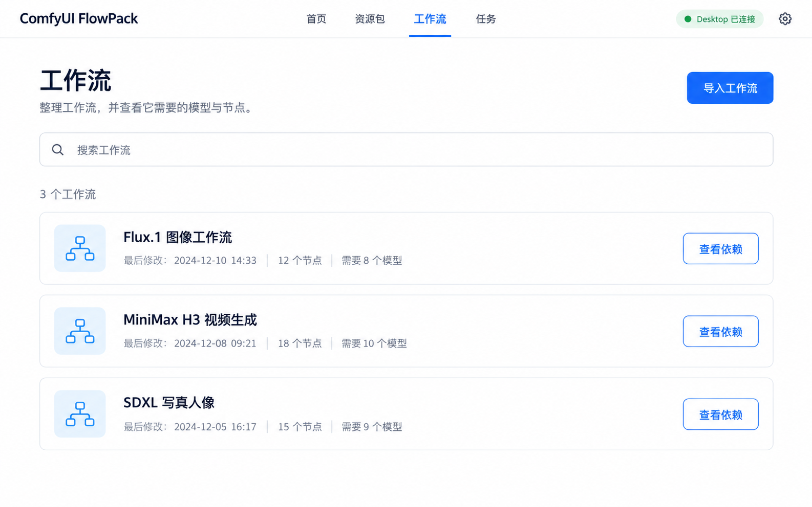
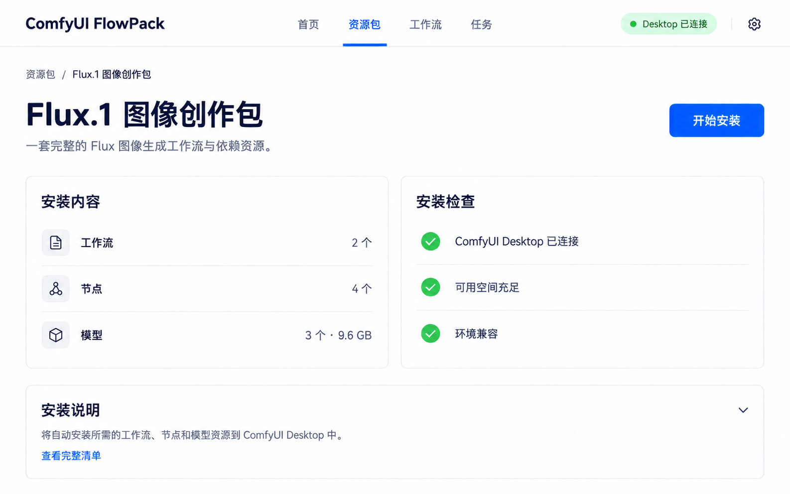
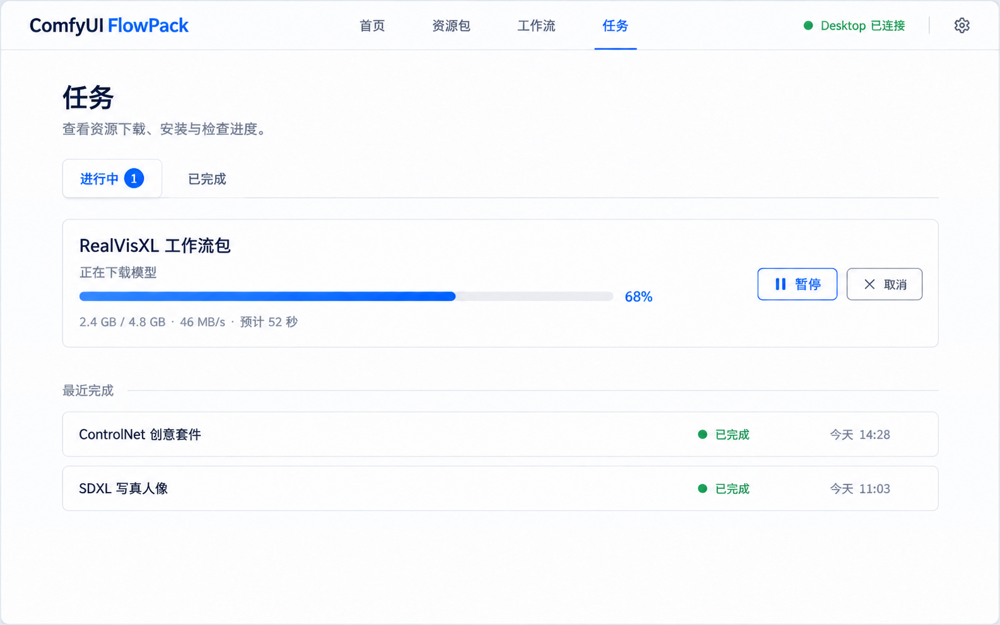
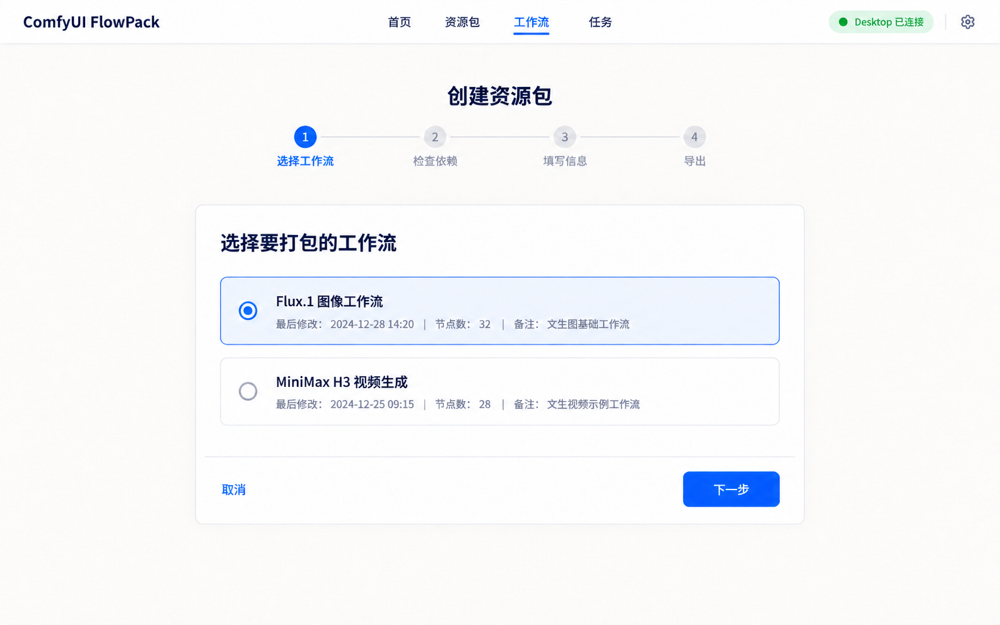
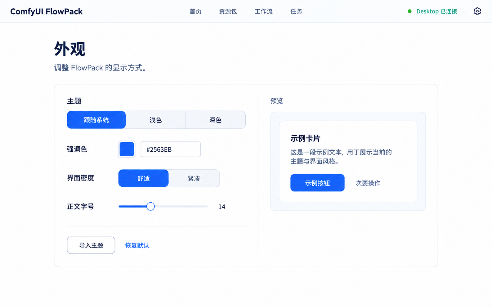

# ComfyUI FlowPack 前端视觉参考

## 2026-09-30 当前布局与功能层级

本节及 [UI_LAYOUT_REPLAN_2026-09-30.md](docs/UI_LAYOUT_REPLAN_2026-09-30.md) 覆盖下方旧布局描述；配色、主题语义与安全边界继续沿用现有规范。

- 顶层：首页 / 我的资源 / 导入安装。任务、设置和实例切换属于全局工具；打包工具归属“我的资源”，对应导航保持高亮。
- 首页：当前实例与真实文件夹入口 → 导入/管理两条主流程 → 当前状态。资源页：搜索与文件夹入口 → 工作流/模型/节点 → 勾选列表与导出。没有空数据统计。
- 工作流/模型/节点文件夹使用已检测的实例路径；多个共享/搜索目录弹出菜单，缺失不创建，切换实例后旧菜单动作拒绝。资源分类路由选中正确页签并保留返回状态。
- 导入页：左侧按内容、清单补全、工作流依赖排序并独立滚动；右侧宽280 DIP，目标、摘要、门禁说明与安装操作常驻。来源、用途和旧清单按需展开，旧清单选中详情在原区内呈现。
- 资源页和任务页使用有限视口。首页和设置自行滚动，壳层不再套全页ScrollViewer。960 DIP下去掉资源快捷组件的重复标签，以保留列表空间。
- 设置按偏好、实例、更新、高级排序。导出保留独立预览窗口与文件详情，关闭不清空资源选择；旧草稿移入折叠工具。
- 实际WPF深浅及最小窗口截图位于 `artifacts/acceptance/ui-redesign-20260930/final/`。本轮全量297通过/5跳过，最后排版修正的WPF专项通过；未完成真实系统DPI/Explorer/全键盘验收，未重建安装器。
- [Figma稿](https://www.figma.com/design/ATifwFUoSDhcXPgeCRVgfS)由可编辑文字、自动布局和复用实例构成。设计环境缺少Segoe UI，用明确标注的Noto Sans SC替代；代码保留Segoe UI。最后文字高度修正后的截图复验因Starter调用额度耗尽未完成。

## 0.0.4 当前规范：苹果式简洁，Windows 原生操作

资源名称必须原文显示：导入复选框使用 TextBlock 内容及显式 AutomationProperties.Name，不能让 AccessText 把文件名中的下划线解释成快捷键。保留静态操作标签的原生快捷键支持。此处由实际 ZIP 导入页面发现，浅/深回归覆盖 RealESRGAN_x2plus.pth 与 __init__.py；遵循 apple-design 的可读性原则，不改变文件本身。

设置页按钮补齐：未单独指定样式的 Button 默认使用 SecondaryButton，沿用语义背景/前景/边框、即时按压反馈和键盘焦点，不再落回系统灰色默认模板。更新操作按内容宽度排列，窄布局可换行；默认层新增实例检测与手动关联，接现有真实命令。浅/深色 WPF 渲染位于 `artifacts/acceptance/settings-graphite-ui/Light-Settings.png` 与 `Dark-Settings.png`，已目视检查空实例提示及说明文字颜色；不是多 DPI/高对比度或安装器验收。按 apple-design 的分组、克制和即时反馈原则处理，没有新增位移动画。

交互补充：资源勾选使用直接可操作的模板 CheckBox，不要求先进入表格编辑状态；未选择当前类别资源时导出按钮不可执行，空计划不能保存。实例下拉框选中态与列表使用同一显示模板，不呈现内部对象字符串。此项由实际隔离页面测试发现，深浅主题控件断言已补齐，修改后的完整页面往返仍待验收。

导出预览采用所属主窗口的独立窗口，不切换资源页面。主表呈现包内路径/大小，来源与哈希按需展开；修改依赖选项后需更新计划，关闭保留选择和筛选。沿用石墨色语义资源、原生关闭/Escape，无位移动画。`artifacts/acceptance/export-preview-ui/Light-ExportPreview.png` 与 `Dark-ExportPreview.png` 是 WPF 空态渲染证据，不是导出成功证据。

本节取代下方历史蓝色参考。`frontend-references/` 的旧 PNG 仅作历史记录，不再作为配色和导航验收标准。

- 依据 Apple HIG 的[设计原则](https://developer.apple.com/design/human-interface-guidelines/design-principles)、[布局](https://developer.apple.com/design/human-interface-guidelines/layout)、[颜色](https://developer.apple.com/design/human-interface-guidelines/color)、[深色模式](https://developer.apple.com/design/human-interface-guidelines/dark-mode)、[字体](https://developer.apple.com/design/human-interface-guidelines/typography)与[材质](https://developer.apple.com/design/human-interface-guidelines/materials)。采用层级、对齐、渐进展开；不复制 macOS 窗口按钮、字体或图标包，不铺满玻璃材质。
- 顶部三入口：首页 / 我的资源 / 导入安装。实例选择、任务、设置在右侧；旧 Packaging/Tasks 路由仍保留，不是主导航入口。应用栏 64 DIP，内容边距 32 DIP，Segoe UI，窗口最小 960×640 DIP。
- 浅色：背景 `#F5F5F7`、内容 `#FFFFFF`、文字与强调 `#1D1D1F`、次级文字 `#646469`。深色：背景 `#161618`、内容 `#222225`、文字与强调 `#F5F5F7`、次级文字 `#B1B1B8`。默认不使用蓝色强调；旧自定义主题保留。
- 控件引用语义资源；复选框、下拉、页签、展开项、表格选择统一适配。主按钮文字按强调色亮度选择黑/白；高对比模式使用 Windows 系统前景/背景，不只靠颜色表达状态。
- 首页目录、导入文件用途、下载来源、安装明细、旧包和高级设置默认折叠。拖入单个文件/目录直接分析，选择变化作废旧安装计划。错误常驻显示。
- 不使用位移动画，交互立即响应。主题切换不重建 ViewModel、不清空资源选择和任务。
- 本轮截图位于 `artifacts/acceptance/graphite-ui/`：实际 WPF 渲染，导入示例数据为测试夹具，不是成功安装证据。尚需完整真实 DPI、键盘、高对比与弹窗交互验收。
- 尚未完成的布局：导出独立预览窗口、任务侧面板；当前仍使用现有路由承载，不能宣称全部精简计划完成。

## 以下为 0.0.3 历史参考（不覆盖当前规范）

## 全局框架

- 参考画布为 1600×1000；桌面窗口默认 1280×800 DIP，最小 960×640 DIP。
- 画面采用暖白背景、深海军蓝正文、钴蓝主操作、浅灰蓝边框、绿色成功状态。卡片圆角为 12 DIP，页面水平边距为 52 DIP。
- 顶部应用栏是所有主页面共用组件，高度固定为 80 DIP，底部使用一条极浅分割线。参考图中不显示系统标题栏和窗口控制按钮。
- 实际 WPF 实现使用一个根 `Grid`：品牌区左对齐、导航组使用 `HorizontalAlignment="Center"` 独立叠放、状态与设置区右对齐。导航不得参与左右区域的宽度分配，导航组的几何中心必须始终等于窗口中心。
- 导航固定为“首页、资源库、打包、安装、任务”，设置由右上角进入。当前项使用蓝色文字和 3 DIP 底部指示线；资源库以 Tab 聚合工作流、模型、节点，安装以 Tab 聚合已导入包和安装预览。
- 小于 960 DIP 时，保留品牌、状态和当前页；其余导航折叠至菜单。该降级不能改变正常宽度下的居中规则。

## 页面参考

| 页面 | 参考图 | 前端职责 |
|---|---|---|
| 首页 |  | 只呈现导入、创建、环境状态和当前任务；不添加统计面板或资源列表。 |
| 资源库 |  | Tab 聚合工作流、模型库、节点管理；各子视图保留搜索与筛选。 |
| 安装 |  | Tab 聚合已导入资源包与安装预览；真实安装未验收前主操作保持禁用。 |
| 任务中心 |  | 显示一个或多个进行中安装任务，以及最近完成记录。 |
| 创建资源包向导 |  | 固定四步：选择工作流、检查依赖、填写信息、导出。 |
| 设置 |  | 语言、更新入口和外观设置；切换语言或主题不得重启 Worker 或丢失状态。 |

## 组件和状态规则

- 页面标题由标题和一行解释构成；只有一个页面级主操作，置于标题行右侧。
- 列表使用纵向留白卡片，不使用密集表格；一行只呈现名称、必要元数据、状态和单个下一步动作。
- 主按钮为钴蓝实色，次按钮为白底蓝色描边，破坏性动作不与主按钮并列显示。
- 成功、警告、失败均同时使用图标、文字和颜色；状态标签保持紧凑，不替代正文说明。
- 下载任务仅在任务中心和首页当前任务位显示实时进度。进度条细、单色、无动画装饰。
- 空状态、加载、错误、离线和权限不足状态沿用相同卡片和排版尺度，不能新增另一套视觉体系。

## 可主题化要求

- 所有页面必须引用语义化主题资源，不在页面 XAML 中写死品牌色、字号、圆角、阴影或边框色。
- 支持浅色、深色、跟随系统，以及主题 JSON 中的强调色、字号、密度和圆角参数。
- `DynamicResource` 用于主题色与控件外观，页面布局使用共享样式与控件模板；切换主题时任务和页面状态不得重置。

## 验收

- 在 1600×1000、1280×800、960×640 和 150% Windows 缩放下，顶部导航均严格以窗口中心为基准，不因品牌、状态文本或设置按钮长度而偏移。
- 六个顶层区域及其嵌入子视图共享同一应用栏、标题层级、按钮样式、卡片边框和状态色。
- 参考图中的信息量是上限：首页不增加最近资源、数据图表、推荐模块或侧栏。
- 视觉实现与参考图有差异时，以本文件的居中、层级、页面归属和可访问性规则为准。
# 任务面板增量（0.0.4 未发布）

当前面板已缩为 440 DIP，改用纵向列表：阶段和中文状态优先，已知总字节才显示石墨进度条，错误完整换行、技术详情折叠。控制按钮只显示当前允许的操作；未知总量不伪造百分比，不增加持续滚动动画。960×640 深浅主题实际 WPF 截图见 `artifacts/acceptance/task-panel-ui/`，夹具清楚标注；下方 720 DIP/旧表格为此前状态。多 DPI 与高对比度仍未完成。

顶部任务按钮已改为右侧面板入口，关闭保留主页面上下文；Esc 与焦点返回已实现。依据 apple-design 的上下文与反馈原则采用实色语义颜色、即时开关，无位移动画。暂时复用现有任务表格，宽度 720 DIP；紧凑列表、深浅主题实际截图及最小窗口/DPI验收仍待完成，不视为最终视觉交付。
