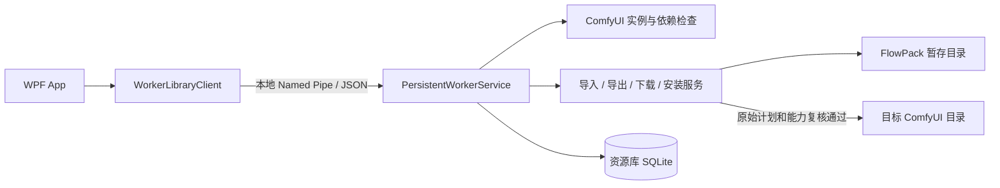

# FlowPack 开发架构

本文依据 2026-10-05 工作区源码，说明当前实现的职责与数据流。运行和构建步骤见 [开发指南](DEVELOPMENT.md)，本轮界面及真实安装证据见 [界面简化记录](UI_SIMPLIFICATION_2026-10-05.md)和 [Desktop 1.1.4 验收记录](DESKTOP_1_1_4_TRANSFER_ACCEPTANCE.md)。安装资格按版本、布局与所需能力匹配，不能从“源码有安装实现”推定任意实例可安装。

## 项目与依赖

FlowPack 是 Windows x64 桌面应用，界面使用 WPF；耗时业务由独立 Worker 执行。生产入口是 App 和 Worker，Smoke 是隔离验收宿主。

| 项目 | 目标框架 | 职责与入口 |
|---|---|---|
| [FlowPack.Core](../src/FlowPack.Core/FlowPack.Core.csproj) | `net10.0` | 清单、工作流、任务、主题与进度契约；不依赖其他项目。 |
| [FlowPack.ComfyUI](../src/FlowPack.ComfyUI/FlowPack.ComfyUI.csproj) | `net10.0` | 实例发现、目录和工作流识别、依赖分析、运行实例核对；依赖 Core。 |
| [FlowPack.Infrastructure](../src/FlowPack.Infrastructure/FlowPack.Infrastructure.csproj) | `net10.0` | SQLite、IPC、持久任务、导入导出、下载、安装与恢复；依赖 Core、ComfyUI。 |
| [FlowPack.App](../src/FlowPack.App/FlowPack.App.csproj) | `net10.0-windows` | WPF 窗口、ViewModel、交互状态与设置；[App.xaml.cs](../src/FlowPack.App/App.xaml.cs) 创建工作区和主窗口。 |
| [FlowPack.Worker](../src/FlowPack.Worker/FlowPack.Worker.csproj) | `net10.0-windows` | [Program.cs](../src/FlowPack.Worker/Program.cs) 取得库锁、启动持久服务与 Named Pipe；另有更新安装入口。 |
| [FlowPack.Tests](../src/FlowPack.Tests/FlowPack.Tests.csproj) | `net10.0-windows` | xUnit 回归、WPF 真窗口与受条件限制的集成测试。 |
| [FlowPack.Smoke](../src/FlowPack.Smoke/FlowPack.Smoke.csproj) | `net10.0-windows` | 隔离 Desktop、更新协调和中断恢复验收；不作为生产 Worker 发货。 |

### 界面代码如何定位

[ShellViewModel.cs](../src/FlowPack.App/ShellViewModel.cs) 与多个 partial 文件共用界面状态；它们不是独立服务。页面布局在 `src/FlowPack.App/Views`，共享样式在 [App.xaml](../src/FlowPack.App/App.xaml)，全局状态和进度在 [MainWindow.xaml](../src/FlowPack.App/MainWindow.xaml)。

| 修改范围 | 主要代码 |
|---|---|
| 首页实例、版本与状态 | [ShellViewModel.Home.cs](../src/FlowPack.App/ShellViewModel.Home.cs)、[HomeView.xaml](../src/FlowPack.App/Views/HomeView.xaml) |
| 页面与设置导航 | [ShellViewModel.Navigation.cs](../src/FlowPack.App/ShellViewModel.Navigation.cs) |
| 目录树、搜索和依赖面板 | [ShellViewModel.Resources.cs](../src/FlowPack.App/ShellViewModel.Resources.cs)、[ResourceBrowserView.xaml](../src/FlowPack.App/Views/ResourceBrowserView.xaml) |
| 扫描、导入和导出命令 | [ShellViewModel.Core.cs](../src/FlowPack.App/ShellViewModel.Core.cs)、[ShellViewModel.Transfer.cs](../src/FlowPack.App/ShellViewModel.Transfer.cs) |
| 在线来源、下载与导入会话 | [ShellViewModel.Online.cs](../src/FlowPack.App/ShellViewModel.Online.cs) |
| 全局任务进度 | [ShellViewModel.Progress.cs](../src/FlowPack.App/ShellViewModel.Progress.cs) |
| 日志与检查更新 | [ShellViewModel.Logging.cs](../src/FlowPack.App/ShellViewModel.Logging.cs)、[ShellViewModel.Updates.cs](../src/FlowPack.App/ShellViewModel.Updates.cs) |

界面规范以 [DESIGN.md](../DESIGN.md) 和实际 XAML 为准。本轮 Figma 云端改版页尚未写入，不应把本地设计源视为已通过云端一致性验收。

## App 与 Worker 通信

[WorkerLibraryClient](../src/FlowPack.Infrastructure/WorkerLibraryClient.cs) 是 App 的资源库访问入口。它读取库内会话信息，先验证已有 Worker；没有可用会话时，启动同一程序目录下的 `worker/ComfyUI.FlowPack.Worker.exe`。源码运行另有查找编译输出的回退路径。

- Worker 在库的 `state/worker.lock` 上持有独占文件锁；启动协调另用 `worker-launch.lock`，避免多个窗口重复启动。
- [NamedPipeWorkerProtocol](../src/FlowPack.Infrastructure/NamedPipeWorkerProtocol.cs) 使用当前 Windows 用户可访问的管道，并检查每次会话的随机密钥、协议版本和请求标识。管道中传输 JSON 元数据，不传输模型二进制内容。
- 当前 [WorkerProtocol](../src/FlowPack.Core/WorkerProtocol.cs) 版本为 `6`。App、Worker 应成对打包；协议不匹配会拒绝请求。
- App 可指定 `--desktop-profile <绝对目录>`，经工作区与客户端传给 Worker。该目录须存在并包含有效登记；实例发现与关联使用这一配置，不回落默认配置。Worker 会话保存规范化后的配置路径，同库的其他配置会话拒绝连接；旧会话缺少该字段时只接受默认配置。该参数不授予安装资格。
- 长任务先返回 `WorkerJob`，客户端轮询 `job.get` 取得阶段、进度与最终结果。连接中断会尝试重连；UI 断开不会直接结束 Worker 中已启动的业务任务。
- 资源库的元数据和业务任务经 Worker 处理；界面偏好和应用日志由各自的设置服务保存。不要从新页面直接另开 SQLite 写连接或绕过 Worker 执行安装。

任务调度与命令路由在 [PersistentWorkerService.cs](../src/FlowPack.Infrastructure/PersistentWorkerService.cs)。其操作包括 `instance.discover`、`inventory.scan`、`dependency.analyze`、`resource.import`、`export.plan`、`export.execute`、`install.plan`、`install.execute` 和 `task.download`。

## 实例发现、资源扫描与在线核对

1. [DesktopInstanceDiscovery](../src/FlowPack.ComfyUI/DesktopInstanceDiscovery.cs) 读取 Desktop 登记、设置和资源搜索配置，形成 `InstanceDescriptor`。描述符分别保存 Core、数据、用户、工作流、节点、模型和 Python 路径，以及配置指纹和问题列表；不能假定这些目录都位于一个根目录。
2. [ResourceInventoryService](../src/FlowPack.ComfyUI/ResourceInventory.cs) 扫描该描述符中的真实目录。额外模型搜索路径单独记录；节点类型归属于节点包；工作流必须通过格式识别，索引等非工作流 JSON 不进入工作流列表。遍历排除虚拟环境、缓存、版本控制目录、链接和已列明的私密文件。
3. [InstanceVersionReader](../src/FlowPack.ComfyUI/InstanceVersionReader.cs) 从 Core 的 `comfyui_version.py` 和 Desktop 可执行文件产品版本读取本地版本。读取不到时返回空值，由界面显示“未确认”。
4. [RuntimeNodeInspector](../src/FlowPack.ComfyUI/RuntimeNodeInspector.cs) 只对能唯一归属于所选实例的运行端点读取 `/system_stats` 和 `/object_info`。它核对进程、端口和启动路径，并在读取后再次确认端点，避免串用另一实例的数据。运行 Core 版本与磁盘版本分别保存。
5. 前端列表核对还需确认用户上下文：当前实现确认默认单用户工作流目录，读取 `/users`，然后请求 `/userdata?dir=workflows&recurse=true&split=false&full_info=true`。多用户身份未明确时不猜用户 ID。[FrontendWorkflowList](../src/FlowPack.ComfyUI/FrontendWorkflowList.cs) 负责解析和规范化列表路径。

离线或在线核对失败时保留磁盘清单，不把失败当作空列表。只有 `FrontendListVerified` 为真，磁盘存在而前端列表缺席的工作流才进入“仅在磁盘发现的工作流”区域；该分类不代表已证实用户删除过文件。

依赖分析使用 [WorkflowReader](../src/FlowPack.ComfyUI/WorkflowReader.cs)、[WorkflowRequirementParser](../src/FlowPack.ComfyUI/WorkflowRequirementParser.cs) 及 [WorkflowDependencyAnalyzer](../src/FlowPack.ComfyUI/WorkflowDependencyAnalyzer.cs)。源码中识别到节点类型，不等于该节点已成功加载；加载证据和静态索引分别保留。

## 导出：一份最终勾选清单

普通导出以 `ResourceSelection.IsSelected` 为唯一载荷选择，资源库勾选与导出页面共用一份最终清单；不再显示参考工作流、写入工作流文件或重复类别开关。`IsReference` 字段保留以兼容旧草稿，不构成普通导出页面的第二份选择。

[ShellViewModel.Transfer.cs](../src/FlowPack.App/ShellViewModel.Transfer.cs) 的 `AddExportDependenciesAsync` 在进入导出时分析已选工作流，加入能唯一确认的依赖；同一选择范围内，每个工作流只自动补选一次。用户取消依赖后，更新计划、切页或返回不会重新勾选，只有“重新添加依赖”才主动补选；清空选择或更换实例后重建相应状态。用户也可取消工作流文件，只导出已选依赖。分析返回前核对输入版本与库存对象，旧结果不能修改新选择。

[ExportSelectionPolicy](../src/FlowPack.ComfyUI/ExportSelectionPolicy.cs) 过滤实际选中资源并按来源路径去重，保留模型、节点单独导出及混合导出的能力。未选中的缺失模型可以留在依赖提示中，但不能因此阻止仅节点包导出；歧义依赖不自动选择。

[PlannedZipExportService](../src/FlowPack.Infrastructure/PlannedZipExportService.cs) 分两步工作：

- `PlanAsync` 展开已选资源，核对模型目录配套文件，计算大小和 SHA-256，检查相对路径与同名异内容冲突。节点按整个节点包的可迁移文件导出，沿用资源遍历的排除规则。
- `ExportAsync` 写临时 ZIP，复制时再次计算 SHA-256，写入 `flowpack-manifest.json`；全部完成后才移动为最终文件。输出已存在时拒绝覆盖，失败或取消时清理本次临时文件。

调整勾选后界面自动更新计划，并以输入版本校验丢弃过期结果；详细路径和校验信息放入高级详情，不再另开重复预览弹窗。Worker 只接受由自身保存过的原始导出计划，不能继续沿用修改选择前的旧计划。

## 导入、暂存与安装的边界

统一入口由 [ResourceImportService](../src/FlowPack.Infrastructure/ResourceImportService.cs) 识别 ZIP、工作流文件、资源目录、旧 `.cpack`、`.cpack.json` 和旧 JSON 清单。选择来源后自动分析、匹配本地资源并生成安装计划，默认使用当前实例；页面没有步骤编号，问题集中在“需要处理”，右侧保留目标、数量、空间、当前状态与安装按钮。来源、实例或选择改变后，旧结果不能重新启用安装按钮。历史记录记录来源与导入结果，再次使用时仍需走核对流程；分析本身不执行安装或自动关闭 ComfyUI。

| 阶段 | 已实现的检查 | 结果含义 |
|---|---|---|
| 读取和解压 | [NativePackageStagingService](../src/FlowPack.Infrastructure/NativePackageStagingService.cs) 检查越界路径、符号链接、重复路径、Windows 保留名称、条目数量、磁盘空间、长度和 CRC。 | ZIP 解压到 FlowPack 专用暂存目录，尚未安装。 |
| 内容识别 | 根据目录、格式和清单形成 `ImportResource`，区分已确认、待确认和未知用途；新 ZIP 清单核对大小及 SHA-256。 | 得到本地资源及待解决问题。 |
| 在线来源 | 旧在线清单的 URL 是下载声明；经下载、哈希核对和 materialize 后才成为本地载荷。 | “导入清单”不等于“已下载全部资源”。 |
| 安装预览 | [ResourceInstallationService](../src/FlowPack.Infrastructure/ResourceInstallationService.cs) 验证实际目标、源文件变化、同名冲突、节点包合并冲突和空间；相同内容可复用。 | 得到有目标指纹的安装计划。 |
| 执行 | Worker 核对计划确为自身保存的原件，重新发现实例和检查部署能力；安装服务重复检查环境、源与目标，并写部署日志。 | 文件部署完成仍需目标实例验证。 |

### 生产安装门禁

[DeploymentCapabilityProvider](../src/FlowPack.Infrastructure/DeploymentCapability.cs) 按 Desktop 产品版本、布局和 Python 依赖能力评估资格。当前内置登记为 `1.1.4`（本机 ProductVersion `1.1.4.0` 的归一化键），覆盖 `standalone-native`、`standalone-adopted` 的文件部署与 Python 依赖能力，EvidenceId 为 `desktop-1.1.4-transfer-20261005`；证据见 [Desktop 验收记录](DESKTOP_1_1_4_TRANSFER_ACCEPTANCE.md)。尚未取得资格的版本或布局可继续检测、检查和导出，但不能据此自动安装。资格来自应用内登记，不接受导入包、旧计划、profile 参数或测试范围文件自行授予资格。

安装计划的 `RequiresPythonDependencies` 为可空布尔值，由 Worker 侧的安装服务根据声明、`requirements.txt` 与 `pyproject.toml` 计算；界面和能力评估共用该结果。执行前重新检查实际 Python 依赖需求、原始计划及目标能力；字段为空的旧计划必须重新生成，仅有文件部署资格不能执行需要 Python 能力的计划。

执行期间还需目标配置指纹保持一致、相关 Python 进程停止、恢复日志可读取。已有异内容文件不直接覆盖。安装中断后重新检查和生成计划，不把旧安装任务直接重试；文件部署和 Python 环境恢复有各自记录。

[Smoke 的 AcceptanceScope](../src/FlowPack.Smoke/AcceptanceScope.cs) 只允许白名单实例和指定测试目录，授予的是受限验收权限，不是生产安装资格。不得把该测试入口改成绕过门禁的普通安装入口。

## 进度、取消与恢复

[OperationProgress](../src/FlowPack.Core/OperationProgress.cs) 携带阶段、已处理量、可选总量和单位。`WorkerJob` 的可选进度字段兼容旧 JSON 任务；下载还保留字节进度。

- 已知总量显示当前阶段百分比，阶段切换可以重新计数；未知总量显示活动进度和已处理量，不推算整体百分比。
- Worker 在后台任务中执行扫描、分析、哈希和文件操作，UI 接收进度更新。资源树按展开构建，列表使用虚拟化，扫描结果分批加入界面。
- App 的全局进度跨页面可见。仅任务允许控制时启用取消；取消是协作式请求，业务到达检查点后收尾，不等于立刻终止进程。
- Worker 重启后将未完成运行状态转为暂停或待检查。缺少可恢复计划的旧任务明确要求重新检查，安装任务不能直接恢复执行。
- [ResourceInstallationService](../src/FlowPack.Infrastructure/ResourceInstallationService.cs) 和 [PythonDependencyService](../src/FlowPack.Infrastructure/PythonDependencyService.cs) 负责中断恢复；未能确认的恢复状态保留待检查提示，不伪装为成功。

## 存储、迁移与兼容

界面中的“资源库”展示所选 ComfyUI 实例的文件；设置中的“存储位置”指定 FlowPack 保存元数据、任务与暂存文件的位置。更改后者不代表移动 ComfyUI 的模型、节点和工作流。

| 数据 | 普通版默认位置 | 便携版位置 |
|---|---|---|
| 库位置关联文件 | `%APPDATA%/ComfyUI FlowPack/library-binding.json` | `Data/Preferences/library-binding.json` |
| FlowPack 默认资源库根目录 | `%LOCALAPPDATA%/ComfyUI FlowPack/Data` | `Data/Library` |
| 偏好与应用日志 | 用户配置目录，由对应设置服务管理 | `Data/Preferences`、`Data/Logs` |

路径以 [LibraryBindingStore](../src/FlowPack.Infrastructure/LibraryBindingStore.cs)、[PortableWorkspace](../src/FlowPack.App/PortableWorkspace.cs) 和 `ShellViewModel.Core.cs` 为准。用户手动关联资源库后，以关联路径为准；便携包内部的库路径可相对便携根目录保存，外部目录仍保留实际路径。

资源库内部的关键文件：

- `state/flowpack.db`：工作流、包清单、草稿、实例记录、持久任务、下载信息与导入会话。
- `state/worker-session.json`、锁文件：本地 Worker 会话和启动协调，包含会话凭证，不应作为普通诊断内容分享。
- `state/backups`：数据库升级前的备份；[ResourceLibraryDatabase](../src/FlowPack.Infrastructure/ResourceLibraryDatabase.cs) 当前 schema 为 `7`，遇到更高 schema 会拒绝写入。
- `staging/imports`、`staging/downloads`：解压输入与下载暂存。
- `state/journal`：文件部署恢复依据；不能当作普通日志随意清理。

[ApplicationLog](../src/FlowPack.Infrastructure/ApplicationLog.cs) 的日志清理独立于数据库和安装恢复记录。设置的一键清理只针对该日志服务自己的日志，不清空资源库。

兼容旧格式时保留明确边界：旧清单可以读取，缺失的本地载荷仍需获取；旧任务可展示，但没有完整计划不自动继续；旧安装计划缺少当前能力证据时必须重建。

## 验证边界与维护原则

与本文流程直接相关的测试包括 [ResourceTransferTests](../src/FlowPack.Tests/ResourceTransferTests.cs)、[TransferFlowTests](../src/FlowPack.Tests/TransferFlowTests.cs)、[PythonCapabilityPlanTests](../src/FlowPack.Tests/PythonCapabilityPlanTests.cs)、[DesktopProfileTests](../src/FlowPack.Tests/DesktopProfileTests.cs)及持久 Worker、运行时核对和 UI 测试。最终回归、便携包与待完成项以 [项目状态](PROJECT_STATUS.md)为准，真实安装证据见 [Desktop 验收记录](DESKTOP_1_1_4_TRANSFER_ACCEPTANCE.md)，不要用“源码有实现”替代真实机器验收结论。

后续修改应保持以下约束：

1. 区分磁盘证据、运行实例证据和用户上下文；查询失败保持未知。
2. 普通导出保留一份最终勾选清单；自动补依赖不能覆盖用户取消，输入变化须使旧结果失效；仅验证实际选中资源的导出条件。
3. IO 放在后台，按真实阶段报告进度；结束收尾之前不报完成。
4. 对目标写入使用 Worker 保存过的计划，执行前重新核对实例和能力；不得接受包内路径作为任意写入授权。
5. 数据迁移保留备份；测试在隔离目录进行，旧记录、用户资源和已有未提交修改均需保留。

本轮候选两布局真实安装、Python 依赖保护、官方 Desktop 启动 Core 的 API 提交与无缓存输出，以及单独的 Python 中断恢复和大于 4 GiB ZIP64 已有实际证据。R3 正式 App 原生布局 UI 安装、正式 Worker 接管布局闭环及实际 App 接管复用预览已正常退出；两布局正式安装后再次生成真实无缓存输出。ComfyUI 前端点击运行、干净机器安装与系统级多显示器/DPI 验收不能由这些证据推定通过，具体以项目状态为准。
