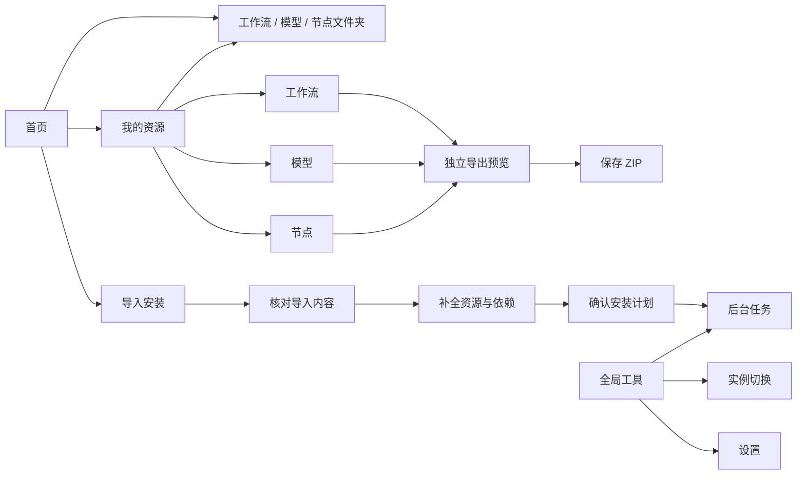

# FlowPack 全页面布局与功能层级重规划

日期：2026-09-30。范围：当前 WPF 应用的主要页面、全局工具和预览窗口；在现有未提交源码上增量实施。

## 页面关系

## 功能归属与页面内部层级

| 页面或工具 | 一级内容 | 二级内容 | 按需展开 | 主要操作 |
|---|---|---|---|---|
| 首页 | 当前实例 | 文件夹直达、导入与安装、管理与分享、当前状态 | 安装位置和资源目录 | 导入 ZIP / 工作流；进入资源库 |
| 我的资源 | 搜索与分类 | 工作流 / 模型 / 节点列表、文件夹入口 | 工作流的关联依赖选项；来源与哈希在导出预览查看 | 扫描、导入、勾选并导出 |
| 导入安装 | 左侧核对内容，右侧确认目标 | 核对导入内容 → 补全清单 → 检查工作流依赖 → 确认安装 | 单文件用途、来源与校验、实际部署路径、已有包与旧清单 | 选择文件、重新检查计划、安装 |
| 后台任务 | 当前真实任务状态 | 阶段、已知字节进度、错误及允许的控制动作 | 操作标识、任务 ID、创建时间 | 刷新、暂停、继续、取消、重试；由命令资格决定 |
| 设置 | 界面偏好 | Desktop 实例、更新 | 自定义外观、资源库位置、诊断与关于 | 即时切换主题/语言；检测和关联实例；手动更新 |
| 导出预览 | 导出选项与摘要 | 文件列表、关闭/更新预览/保存操作 | 所选文件的来源路径与 SHA-256 | 保存 ZIP；关闭保留原页面与选择 |
| 打包工具 | 资源库下级工具 | 选择资源 → 检查依赖与内容 → 保存 ZIP | 旧草稿兼容工具 | 生成预览、保存 ZIP |
| 旧清单 | 导入安装内的兼容区 | 已有包列表与选中包预览 | 默认折叠 | 导入旧清单/展开目录、下载已确认资源；旧安装入口继续禁用 |

顶层保持“首页 / 我的资源 / 导入安装”三个入口。实例切换、任务、设置属于全局工具；打包页使用“我的资源”导航高亮。保留任务独立路由以及右侧面板，关闭面板保留当前页面并恢复焦点。

## 新增和修正的实际功能

- 首页与资源页复用文件夹入口。一个已确认目录时直接用 Windows 文件资源管理器打开；多个目录时弹出可选路径菜单。
- 工作流使用 `WorkflowsDirectory`；节点包含 `CustomNodesDirectory` 和已登记的附加节点路径；模型包含默认写入目录、搜索根目录和按类别登记的附加目录。路径规范化并去重，拒绝相对路径，不猜目录、不建目录。
- 菜单执行时再次确认路径属于当前实例，防止切换实例后仍打开旧入口。目录不存在或无法访问时显示实际原因。
- 模型/节点/工作流路由选中对应页签；返回资源页保留上次分类。类别搜索及跨筛选的资源勾选行为保留。
- 取消壳层统一的外部纵向滚动。资源表格与任务列表获得有限视口；首页和设置自行滚动；导入页左侧列表独立滚动，右侧安装操作始终留在视口。
- 选中旧清单后能在原兼容区看到详情。不会把清单声明当作真实安装能力。

## 视觉规则

沿用当前石墨灰语义资源、Windows 字体及原生窗口。采用卡片分组、明确的搜索标签、顺序标题、可见空态和按需展开的技术信息；不添加装饰动画或无数据的统计。

主窗口继续支持最小 960×640 DIP。导入页确认区宽 280 DIP，任务面板宽 440 DIP；这些是本轮布局尺寸，来自源码和 WPF 渲染验证，不是对所有系统 DPI 的兼容结论。

## Figma 交付

[可编辑设计文件](https://www.figma.com/design/ATifwFUoSDhcXPgeCRVgfS)

包括首页、工作流/模型/节点三个资源页、导入安装、任务、设置、打包、导出预览和功能层级说明。主要图层为文字、自动布局容器和按钮/导航实例，没有整页截图填充。建立了深浅主题语义颜色变量；当前主要画板为浅色示意。

Figma 环境不提供 Segoe UI，因此稿件明确使用 Noto Sans SC；WPF 仍使用 Segoe UI。Figma 服务限制单 collection 只有一个 mode，因此深浅变量以 Light/ 和 Dark/ 命名保存在同一 collection。

最后一次修正恢复了多行文字的自动高度，并返回修正前后的真实高度。随后触及 Starter 套餐的 MCP 调用上限，无法为最后的文字修正再截图复验；保留这一限制，不将其写成最终视觉验收通过。此前截图保存在 `artifacts/acceptance/ui-redesign-20260930/figma/`。

## 验证与边界

本轮验证结果记录于 `artifacts/acceptance/ui-redesign-20260930/validation/`，WPF 实际渲染在 `final/`，原布局与源码快照在 `before/` 与 `source-before/`。

本轮 Release 全量回归：**297 通过、5 专项默认跳过**，记录 `full-regression-final.trx`。随后最小窗口截图发现资源页快捷入口换行挤压列表，收起重复标签并调整空态位置；最终 WPF 页面专项通过，记录 `compact-layout.trx`。Release 构建没有警告或错误；`git diff --check` 通过。五项跳过涵盖真实 Desktop 页面/双核心、Python 安装/中断以及大于 4 GiB 归档等专项，本轮没有将这些项目作为已验证结果。

新增验证关注共享目录、去重、不创建缺失目录、旧实例菜单失效、分类跳转/返回记忆，以及最小窗口下安装按钮留在视口。沿用原页面回归验证深浅主题、导航居中、资源选择、导出窗口和高对比色板。

截图中用于检查文件名、错误与进度的数据为明确标注的测试夹具；不代表真实下载、模型推理或安装成功。没有执行 Desktop 安装、启用生产资格、重建安装器或发布。真实 Explorer 打开、系统 DPI 变化和完整键盘/弹窗实机验收仍未逐项完成。
